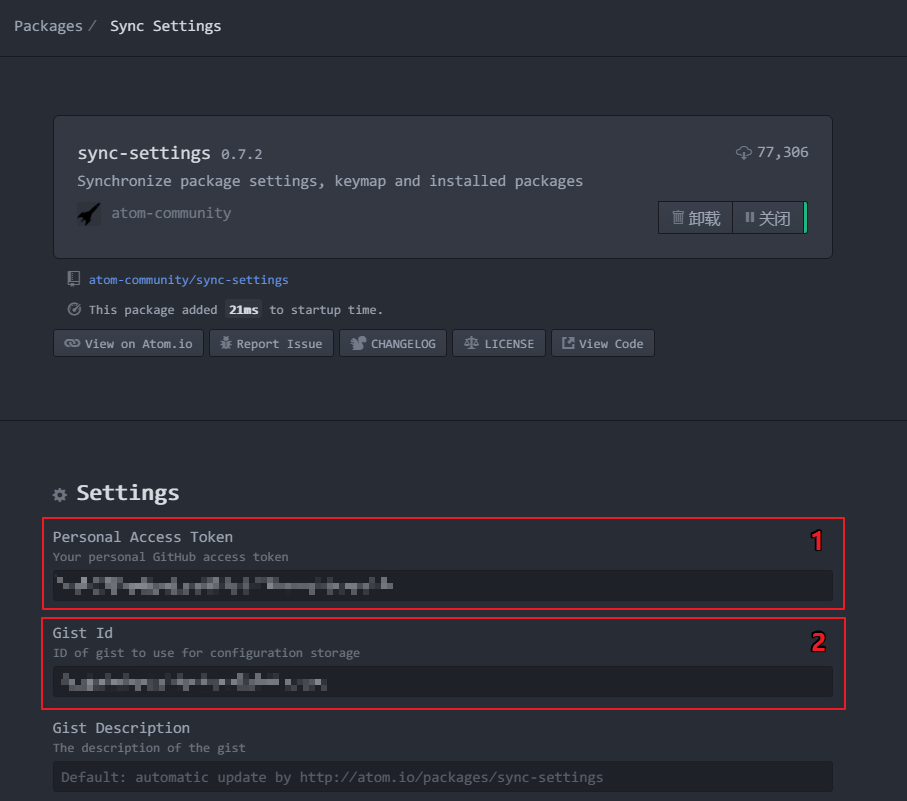
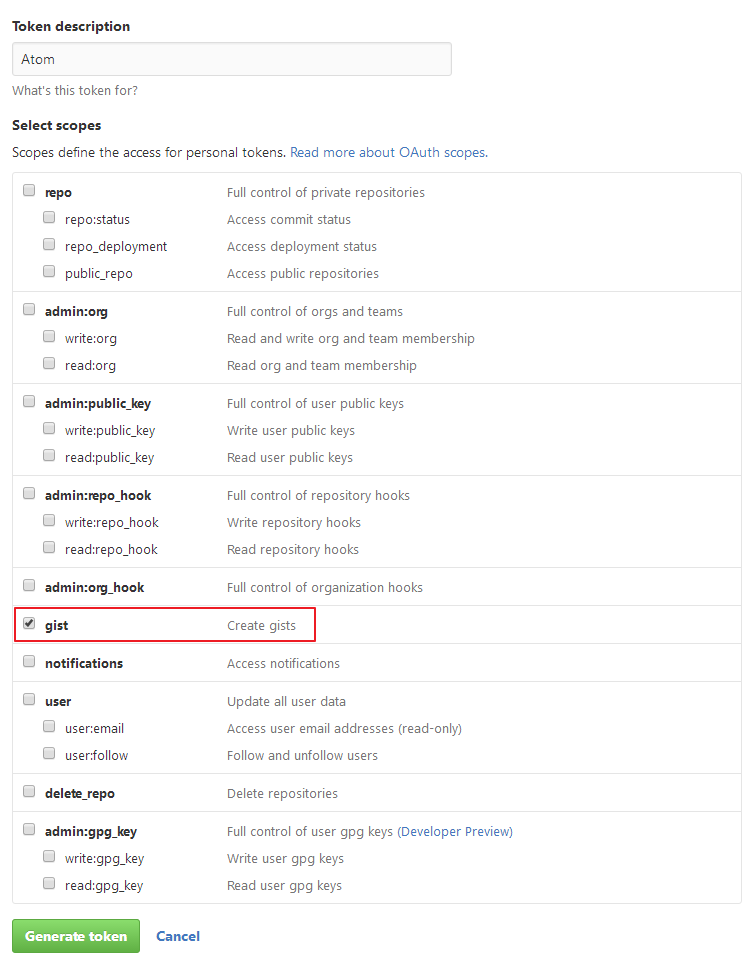
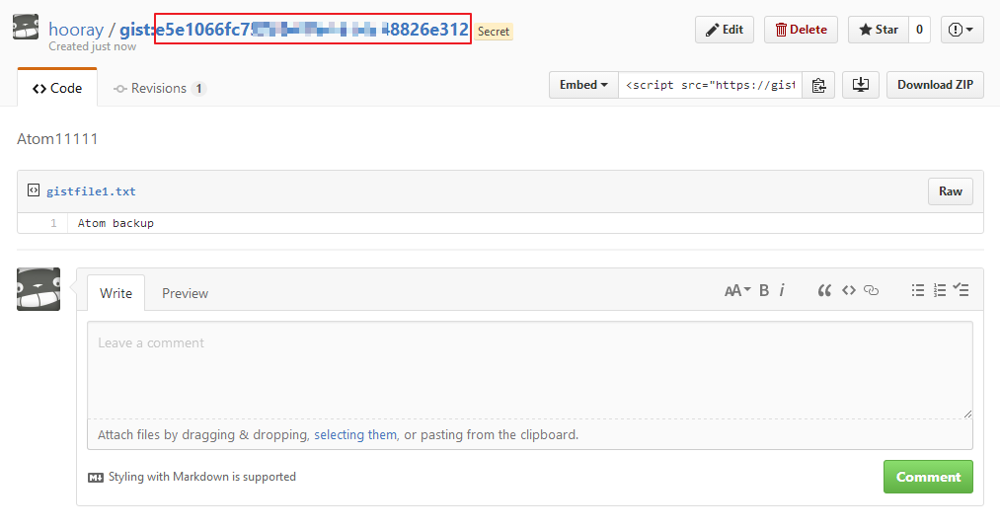
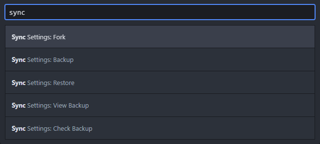

### Atom设置备份， sync settings备份
##### 1. 在设置里面搜索安装 sync-settings，进入设置如图：

##### 2. Github创建personal access token(要勾选gist)，然后复制生成的 token 序列粘贴到插件的上图中标1的红框里。
网址： https://github.com/settings/tokens/new

##### 3. 创建Github的gist服务，生成的gistID粘贴到插件的上图中标2的红框里。

##### 4. 备份配置
文档编辑页面键入快捷键「Ctrl + Shift + P」，输入“ sync ”就能看到以下选项：
> 选择Backup备份， Restore恢复

备份成功或者失败，在右上角都会有提示
> 内容来自: https://www.cnblogs.com/hooray/p/5885211.html
