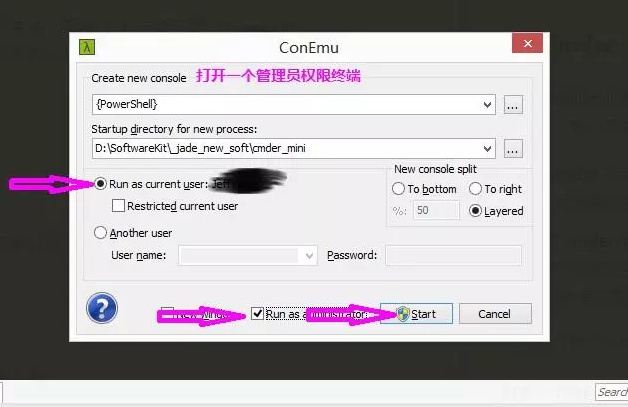

## cmder介绍
#### 安装
Cmder官网http://cmder.net/，下载的时候，有两个版本，分别是mini与full版；唯一的差别在于有没有内建msysgit工具，这是Git for Windows的标准配备。同时git里面带有大量linux命令。
#### 配置cmder
1. 把`cmder`添加到环境变量，加完之后,Win+r一下输入cmder,即可。
2. 把`cmder`添加到右键菜单 `Cmder.exe /REGISTER ALL` 
3. 打开一个管理员权限终端, 输入 Ctrl + t, 或者点击下面控制条的绿色加号, 勾选 Run as administrator 

4. 解决文字重叠问题 `Win + Ait + P 唤出设置界面 > mian > font > monospce,去掉那勾勾即可`
5. 修改提示符号λ --> vendor\clink.lua -->找到42行的"{lamb}'' 改为想要的符号，然后重启cmder即可
6. 解决中文乱码Settings ->Startup -> Environment中添加一行：`set LC_ALL=zh_CN.UTF-8`
7. git log乱码，先设置编码，然后执行 `git config --global i18n.logoutputencoding utf-8`
8. `ctrl+u` 删除当前命令行内容
9. `ctrl+l` 清屏
10. `Ctrl+T` 建立新页签
11. `Ctrl+W` 关闭页签
12. `Ctrl+Tab` 切换页签
13. `Alt+Shift+1` 开启cmd.exe
14. `Alt+Shift+2` 开启powershell.exe
15. `Alt+Shift+3` 开启powershell.exe (系统管理员权限)
16. `Alt + enter` 切换到全屏状态；