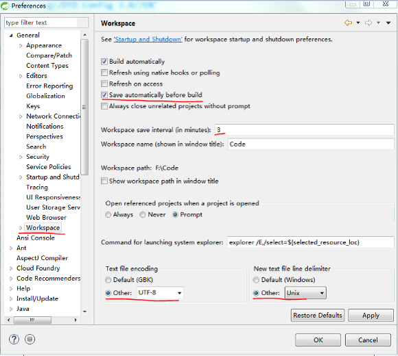
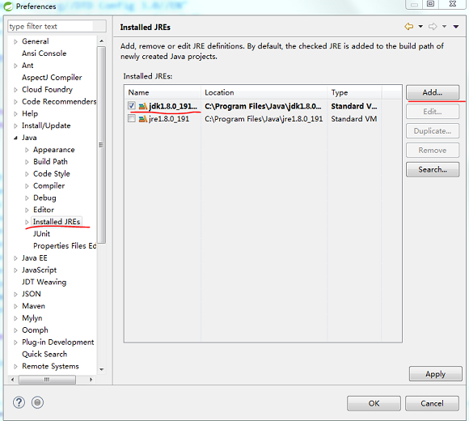
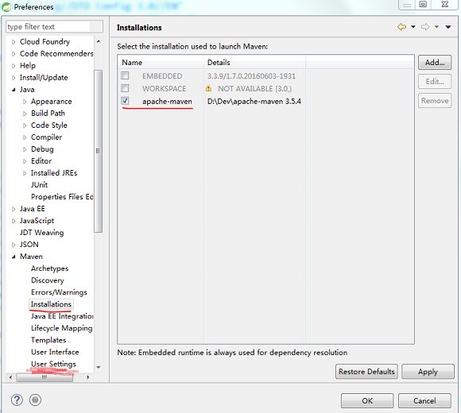
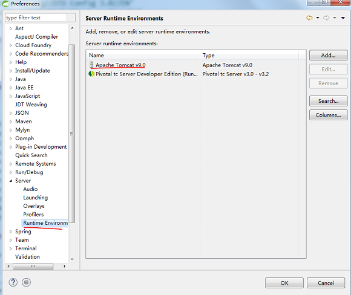
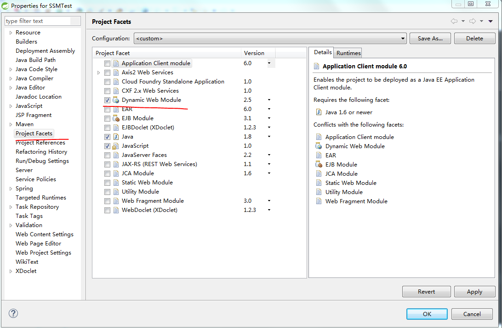

## eclipse配置环境
1. utf-8 编码和自动保存 

2. jdk外部环境配置 

3. maven外部环境配置，同理setting也需要配置 

4. Tomcat外部环境配置 

5. lombok插件安装
    1. 进入lombok.jar 目录下执行：`java -jar lombok-1.18.2.jar`，在弹出的dialog里选择eclipse的安装路径， clean project 就可以使用
6. 自动生成web.xml  project-->properties-->Project Facets。重新保存`Dynamic Web Module`

7. 避免`User Operation Is Wating`
    1. project->properties->Builders 将带有 validator的选项全部去掉