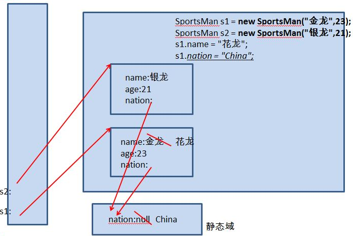

## static
1. 范围：
    * 在Java类中，可用static修饰属性、方法、代码块、内部类
2. 特点:
    * 随着类的加载而加载
    * `优先于对象存在`
    * 修饰的成员，被所有对象所共享，称为`类变量`
    * 访问权限允许时，可不创建对象，直接被类调用
    * 类变量存储在`静态域`中(实际上也是方法区中)

## static内存解析

## static修饰方法(类方法)
1. 随着类的加载而加载，在内存中也是独一份，在静态域中
2. 可以直接通过“类.类方法”的方式调用
3. 内部可以调用静态的属性和静态方法，而不能调用非静态的属性或方法。声明周期不同，晚的不能调用早的
4. 非静态的方法可以调用静态的属性和静态的方法
5. 静态方法中不能含有关键字`this`或`super`