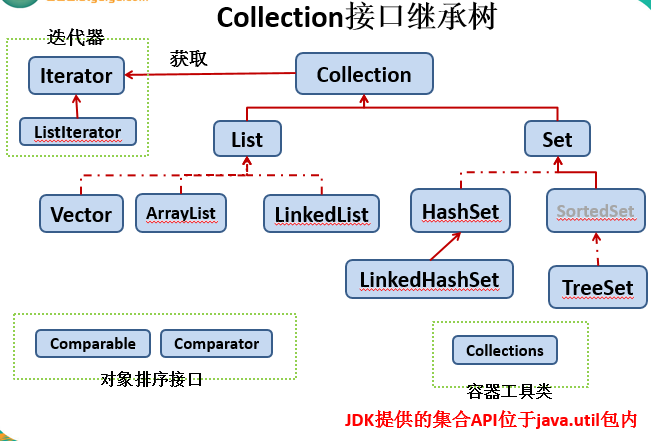
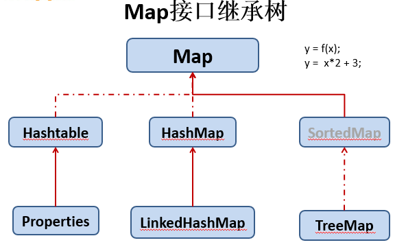

## Java集合可分为Collection和Map两种体系
1. Collection接口：
    - `Set`：元素无序、不可重复的集合
    - `List`：元素有序，可重复的集合
2. Map接口：
    - 具有映射关系"key-value"的集合

## Collection接口继承树


## Map接口继承树


## ArrayList.toString()
1. 以`[AA, BB]`的形式输出内容，其实就是存放内容的`toString()`
2. 如果是JavaBean，那么也是输出的`toString()`方法的内容，所以最好是重写JavaBean的`toString`方法
3. 具体实现是在`AbstractCollection`类中
```
// toString的具体实现方法
public String toString() {
  Iterator<E> it = iterator();
  if (! it.hasNext())
      return "[]";

  StringBuilder sb = new StringBuilder();
  sb.append('[');
  for (;;) {
      E e = it.next();
      sb.append(e == this ? "(this Collection)" : e);
      if (! it.hasNext())
          return sb.append(']').toString();
      sb.append(',').append(' ');
  }
}

// 输出内容的测试
public class TestToString {

    public static void testArrayListToString() {
        Collection co = new ArrayList(); // 要想直接使用，使用Collection声明
        Person p = new Person("Lisi", 24);
        co.add("lLL");
        co.add(p);
        co.add(123);
        System.out.println(co);

        List<Person> list = new ArrayList<Person>();  // 要想使用List声明，必须符合泛型的规定
        list.add(new Person("Wang", 33));
        list.add(new Person("San", 44));
        System.out.println(list);
    }

    public class Person {
       public String name;
       public Integer age;

       public Person(String name, Integer age) {
           this.name = name;
           this.age = age;
       }

       @Override
       public String toString() {
           return "[Person name:" + name + "  age:" + age + "]";
       }
   }
}

```

## Collection.contains(Object obj)
- 判断集合中是否包含指定的obj元。如果包含返回true
- 判断依据，根据元素所在的类的equals()方法进行判断，如果没有重写，比较的是地址值

## b.containsAll(Object a)
- 判断集合b中是否全部包含a

## coll.retainAll(collA)
- 求当前集合与collA的共有元素，返回给当前元素

## removeAll(Collection coll)
- 从当前集合中删除包含在coll中的元素

## toArray()
- 将集合转化为数组

## iterator()
- 返回一个Iterator接口实现类的对象