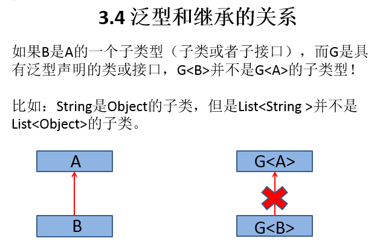

## 泛型
> 1. Java泛型可以保证如果程序在`编译时没有发出警告`，运行时就不会产生`ClassCastException`异常
> 2. 只有指定类型才可以添加到集合中：类型安全。读取出来的`对象不需要强转`：便捷

## 泛型声明
1. interface List<T> 和 class TestGen<K,V> 
    - T,K,V不代表值，而是表示类型。这里使用任意字母都可以。常用T表示，是Type的缩写
    - T只能是类，`不能用基本数据类型填充`
  
## 泛型实例化
1. 一定要在类名后面指定类型参数的值（类型）。如：
    - `List<String> strList = new ArrayList<String>();`
    - `Iterator<Customer> iterator = customers.iterator();`
  
## 注意点
1. 对象实例化时不指定泛型，默认为：Object
2. `静态方法中不能使用类的泛型`
3. 如果泛型类是一个接口或抽象类，则不可创建泛型类的对象
4. 不能在catch中使用泛型
5. 继承泛型类或者泛型接口，可以泛型具体化也可以不具体化
6. `把一个集合中的内容限制为一个特定的数据类型，这就是generics背后的核心思想`

## 自定义泛型类
```
class Person<T>{
	//使用T类型定义变量
	private T info;
	//使用T类型定义一般方法
	public T getInfo(){
		return info;
	}
	public void setInfo(T info){
		this.info = info;
	}
   //使用T类型定义构造器
   public Person(){}
   public Person(T info){
   	this.info = info;
   }
   //static的方法中不能声明泛型
   //public static void show(T t){
   //}
   //不能在try-catch中使用泛型定义
   //try{}
   //catch(T t){}		
}

```

## 泛型方法
- `[访问权限]  <泛型>  返回类型  方法名([泛型标识 参数名称])  抛出的异常`
```
public class DAO<T> {
	
	public <E>  E get(int id, E e){
		
		E result = null;
		
		return result;
	}}

```

## 泛型的继承关系
<br>

## 通配符
1. 使用类型通配符：？
    - 比如：List<?>   ，Map<?,?>
    - List<?>是List<String>、List<Object>等各种泛型List的父类
1. 读取List<?>的对象list中的元素时，永远是安全的，因为不管list的真实类型是什么，它包含的都是Object
2. 写入list中的元素时，不行。因为我们不知道c的元素类型，我们不能向其中添加对象。
    - 唯一的例外是null，它是所有类型的成员
<br>


## 有限制的通配符
1. <?> 允许所有泛型的引用调用
举例：<br>
<? extends Number>     (无穷小 , Number]<br>
只允许泛型为Number及Number子类的引用调用<br>
<br>
<? super Number>      [Number , 无穷大)<br>
只允许泛型为Number及Number父类的引用调用<br>
<br>
<? extends Comparable><br>
只允许泛型为实现Comparable接口的实现类的引用调用<br>
