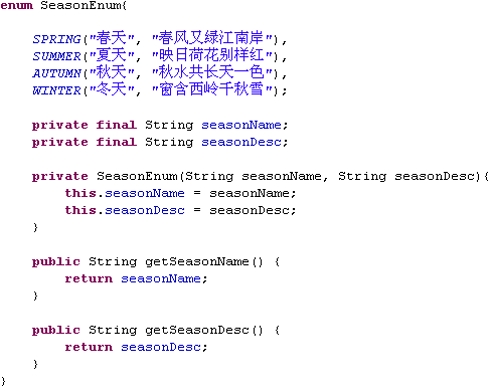

## 枚举类
1. 枚举类`对象的属性`不应允许被改动, 所以应该使用`private final`修饰
2. 枚举类的使用`private final`修饰的属性应该在构造器中为其赋值
3. 若枚举类显式的定义了带参数的构造器, 则在列出枚举值时也必须对应的传入参数

## Enum枚举类
1. 必须在枚举类的第一行声明枚举类对象。
2. 枚举类和普通类的区别：
    - 使用 enum 定义的枚举类默认继承了 java.lang.Enum 类
    - 枚举类的构造器只能使用 private 访问控制符
    - 枚举类的所有实例必须在枚举类中显式列出(, 分隔    ; 结尾). 列出的实例系统会自动添加 public static final 修饰
3. JDK 1.5 中可以在 switch 表达式中使用Enum定义的枚举类的对象作为表达式, case 子句可以直接使用枚举值的名字, 无需添加枚举类作为限定 

> 上面例子中，第一行是枚举对象，等价`public static final SeasonEnum SPRING = new SeasonEnum("春天"， "春风又绿江南岸");`

## 枚举类的主要方法
1. values()方法：返回枚举类型的对象数组。该方法可以很方便地遍历所有的枚举值
2. valueOf(String str)：可以把一个字符串转为对应的枚举类对象。要求字符串必须是枚举类对象的“名字”。如不是，会有运行时异常

## 枚举类实现接口
- 若需要每个枚举值在调用实现的接口方法呈现出不同的行为方式, 则可以让`每个枚举值分别来实现该方法`，即枚举对象要实现接口方法
- 枚举类实现接口
