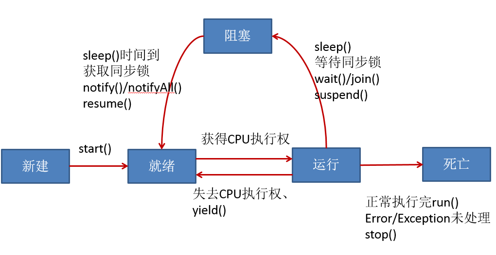

## 多线程
1. `SubThread extends Thread` 来实现线程
   - `subThread.start()` 启动线程，同一个对象调用2次，会报异常
   - `subThread.run()` 线程中要执行的操作。对象调用方法，并不会启动新的线程
   - `Thread.currentThread()` 静态方法，获取当前线程的对象
   - `getName()` 获取当前线程的名字
   - `setName()` 设置此线程的名字
   - `yield()` 释放当前cpu的执行权，之后再重新获取
   - `join()` 在A线程中调用B线程的join()方法，表示：当执行到此方法，A线程停止执行，直到B线程执行完毕，A线程再接着join()后的方法执行
   - `isAlive()` 判断当前线程是否还存活
   - `sleep(long l)` 显示的让当前线程睡眠l毫秒
2. `PrintNum implements Runnable`  来实现线程，常用
   - `new Thread(printNum).start()` 来启动线程，执行Thread对象生成时构造器形参的对象的run方法
   - 如果多个线程要操作同一份资源，更适合用实现的方式

## Java的调度方法
1. 同优先级线程组成先进先出队列，使用时间片策略
2. 对高优先级，使用优先级调度的抢占式策略

## 线程的声明周期

## 解决线程安全问题
1. 必须让一个线程操作共享数据完毕后，其它线程才有机会参与共享数据的操作
2. 同步代码块(synchronized)
    - `synchronized(对象) { // 需要被同步的代码块(即为操作共享数据的代码)}`
    - `共享数据`：多个线程共同操作的同一个数据（变量）
    - `同步监视器`：由一个类的对象来充当。那个线程获取此监视器，谁就执行大括号里被同步的代码，俗称：锁
> 在实现的方式中，考虑同步的话，可以使用`this`来充当锁。 
> 但是在继承的方式中，要慎用`this`，要确保对象的唯一
3. 同步方法
    - 将操作共享数据的方法声明为`synchronized`，即此方法为同步方法，能够保证当其中一个线程执行此方法时，其它线程在外等待直至此线程执行完此方法
    - 同步方法锁的对象是`this`
> 在实现的方式中，方法锁的对象是`this` 
> 在继承的方式中，`this`对象不一定唯一，可能多个对象，因为需要再另外加锁
4. 对于静态方法而言，使用当前类本身充当锁`synchronized(A.class)`
   
## 释放锁的操作
1. 当前线程的同步方法、同步代码块执行结束
2. 当前线程在同步代码块、同步方法中遇到break、return终止了该代码块、该方法的继续执行。
3. 当前线程在同步代码块、同步方法中出现了未处理的Error或Exception，导致异常结束
4. 当前线程在同步代码块、同步方法中执行了线程对象的wait()方法，当前线程暂停，并释放锁

## 不会释放锁的操作
1. 线程执行同步代码块或同步方法时，程序调用Thread.sleep()、Thread.yield()方法暂停当前线程的执行
2. 线程执行同步代码块时，其他线程调用了该线程的suspend()方法将该线程挂起，该线程不会释放锁（同步监视器）。
3. 应尽量避免使用suspend()和resume()来控制线程

## 线程的通信
1. `wait()`：令当前线程挂起并放弃CPU、同步资源，使别的线程可访问并修改共享资源，而当前线程排队等候再次对资源的访问
2. `notify()`：唤醒正在排队等待同步资源的线程中优先级最高者结束等待
3. `notifyAll()`：唤醒正在排队等待资源的所有线程结束等待.
4. Java.lang.Object提供的`这三个方法只有在synchronized方法或synchronized代码块`中才能使用，否则会报java.lang.IllegalMonitorStateException异常
