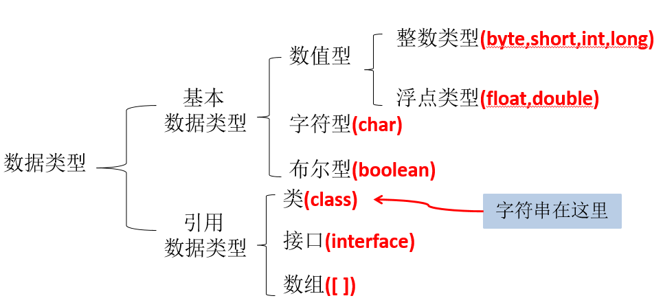

## Java数据类型

## 基本数据类型
1. `byte` 1字节=8bit(-128 ~ 127)
2. `short` 2字节 (-2^15 ~2^15-1 )
3. `int` 4字节 (-2^31 ~ 2^31-1)
4. `long` 8字节 (-2^63 ~ 2^63-1)
5. `float` 4字节 (-3.403E38 ~ 3.403E38)
6. `double` 8字节 (-1.798E308 ~ 1.798E308)

## 基本数据类型转换
1. `char,byte,short` ==> `int` ==> `long` ==> `float` ==> `double`
2. `char,byte,short`不能相互转(包括自己的运算)，必须先转换为`int`

## 运算符(short运算)
> int s=10; 
>  // s = s+3; 编译不能通过
> s = (short)(s+3); // 牺牲性能，不建议这样做
> s += 1;  // 既可以实现运算，又不会改变s的数据类型
