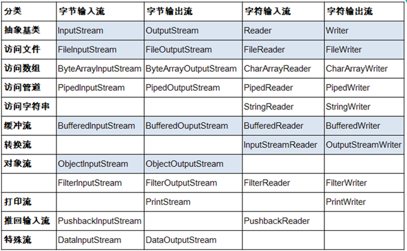

## File类
1. 文件和目录路径名的抽象表示形式，与平台无关
2. File 能新建、删除、重命名文件和目录，但 File 不能访问文件内容本身。如果需要访问文件内容本身，则需要使用输入/输出流。
3. File对象可以作为参数传递给流的构造函数
4. 路径
      1. 绝对路径：包盘盘符在内的完整的文件路径
      2. 相对路径：在当前文件目录下的文件路径。（项目工程开始）
      3. 路径分隔符，UNIX中，此字段为‘/’，在Windows中，为‘\\’
      >// File file = new File("f:\\Code\\JavaTest\\Hello.txt");<br>
      >// File file = new File("f:/Code/JavaTest/Hello.txt");<br>
      > 两种效果一致

## 流的分类
1. 文件流（节点流），最基本的，直接作用于文件上的
      1. `FileInputStream` 处理字节流，每次处理8bit，不可在控制台输出中文，但能处理文本
      2. `FileOutputStream`
      3. `FileReader` 处理字符流，每次处理16bit（2B），可在控制台输出中文
      4. `FileWriter`
>1. 使用FileReader，FileWriter可以实现文本文件的复制
>2. 对于非文本文件（视频文件、音频文件、图片文件），只能使用字节流
2. 缓冲流（处理流）
      1.  `BufferedInputStream`
      2.  `BufferedOutputStream`
      3.  `BufferedReader`
      4.  `BufferedWriter`
3. 转换流
      1. `InputStreamReader`
      2. `OutputStreamWriter`
4. 打印流
      1. `PrintStream`
      2. `PrintWriter`
5. 数据流、对象流（设计序列化和反序列化）、随机存取流
   1. `DataInputStream`
   2. `DataOutputStream`
   3. `ObjectInputStream`
   4. `ObjectOutputStream`
   5. `RandomAccessFile`

## 操作数据单位不同分为字节流(8bit)，字符流(16bit)
1. 字节流基类 `InputStream`和`OutputStream`
2. 字符流 `Reader`和`Writer`

## IO体系


## FileInputStream
> FileInputStream read方法读取文件的一个字节，当执行到结尾的时候时，返回-1。读取到的为整数，通过(char)b来转换
```
  // File file = new File("f:\\Code\\JavaTest\\Hello.txt");
  // File file = new File("f:/Code/JavaTest/Hello.txt");
  File file = new File("Hello.txt");
  FileInputStream fis = null;
  byte[] b = new byte[2];
  
  try {
      fis = new FileInputStream(file);
      if(file.isFile()) System.out.println("file exist");
      int len;
      
      // while((len = fis.read()) != -1) {
      //     System.out.println((char)len);
      // }

      while((len = fis.read(b)) != -1) {
          // for(int i = 0; i < b; i++) {
          //     System.out.println("read(byte[]): " + (char)t[i]);
          // }
          System.out.println("read(byte[]): " + new String(b, 0, len));
      }
  } catch (FileNotFoundException e) {
      e.printStackTrace();
} catch (IOException e) {
      e.printStackTrace();
  } finally {
      if(fis != null) {
          try {
              fis.close();
          } catch (IOException e) {
              e.printStackTrace();
          }
      }
  }
}
```

## FileOutputStream
```
  // 创建一个File对象，表明要写入的文件位置
  // 输出的物理文件可以不存在，执行的时候自动创建。若存在，自动覆盖
  File file = new File("hello2.txt");
  // 创建一个FileOutputStream对象，将file的对象作为形参传递给FileOutPutStream的构造器中
  FileOutputStream fos = null;
  try {
      fos = new FileOutputStream(file);
      // 写入操作，是写的byte数组，但是查看文档时，显示正常英文
      fos.write(new String("I love China").getBytes());
      /**
       * 一般拷贝文件执行写入操作如下：
       * while((len = fis.read(b)) != -1) {}
       *    fos.write(b, 0, len);
       * }
       *  
       * 两种错误写法
       *  1. fos.write(b);
       *  2. fos.write(b, 0, b.length)
       */
  } catch (Exception e) {
      e.printStackTrace();
  } finally {
      // 关闭输出流
      if(fos != null) {
          try {
              fos.close();
          } catch (IOException e) {
              // TODO Auto-generated catch block
              e.printStackTrace();
          }
      }
  }
```

## FileReader  字符节点流，可处理中文。char.txt里面是中文，不会乱码
```
  File file = new File("char.txt");
  try {
      FileReader fr = new FileReader(file);
      char[] c = new char[24];
      int len;
      try {
          while ((len = fr.read(c)) != -1) {
              System.out.println(new String(c, 0, len));
          }
      } catch (IOException e) {
          e.printStackTrace();
      }
  } catch (FileNotFoundException e) {
      e.printStackTrace();
  }
```