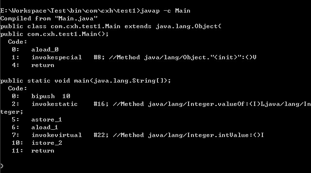
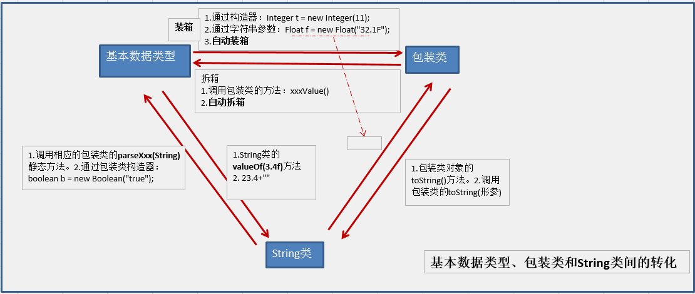

## Java中的自动装箱和自动拆箱
- 在Java SE5之前，如果要生成一个数值为10的Integer对象，必须这样进行：`Integer i = new Integer(10);`
- Java SE5开始就提供了自动装箱的特性，如果要生成一个数值为10的Integer对象，只需要这样就可以了：`Integer i = 10;`
>* 装箱就是自动将基本数据类型转换为包装器类型 `Integer i = 10;  //装箱`
>* 拆箱就是自动将包装器类型转换为基本数据类型 `int n = i;   //拆箱`

## 装箱和拆箱的实现
- 装箱过程是通过调用包装器的valueOf方法实现的，而拆箱过程是通过调用包装器的 xxxValue方法实现的。（xxx代表对应的基本数据类型）
- 测试类
```
public class Main {
    public static void main(String[] args) {
         
        Integer i = 10;
        int n = i;
    }
}
```

- 从反编译得到的字节码内容可以看出，在装箱的时候自动调用的是Integer的valueOf(int)方法。而在拆箱的时候自动调用的是Integer的intValue方法
- 其他的也类似，比如Double、Character

## 包装类之间的相互转换


## 面试中相关问题
#### 1.整型装箱的测试
```
public class Main {
    public static void main(String[] args) {
         
        Integer i1 = 100;
        Integer i2 = 100;
        Integer i3 = 200;
        Integer i4 = 200;
         
        System.out.println(i1==i2);
        System.out.println(i3==i4);
    }
}
```
- 输出结果 `true  false`
- 分析，输出结果标明`i1`和`i2`指向同一个对象，而`i3`和`i4`指向的是不同的对象，源码分析
```
public static Integer valueOf(int i) {
        if(i >= -128 && i <= IntegerCache.high)
            return IntegerCache.cache[i + 128];
        else
            return new Integer(i);
    }

private static class IntegerCache {
        static final int high;
        static final Integer cache[];

        static {
            final int low = -128;

            // high value may be configured by property
            int h = 127;
            if (integerCacheHighPropValue != null) {
                // Use Long.decode here to avoid invoking methods that
                // require Integer's autoboxing cache to be initialized
                int i = Long.decode(integerCacheHighPropValue).intValue();
                i = Math.max(i, 127);
                // Maximum array size is Integer.MAX_VALUE
                h = Math.min(i, Integer.MAX_VALUE - -low);
            }
            high = h;

            cache = new Integer[(high - low) + 1];
            int j = low;
            for(int k = 0; k < cache.length; k++)
                cache[k] = new Integer(j++);
        }

        private IntegerCache() {}
    }
```
- 从这2段代码可以看出，在通过valueOf方法创建Integer对象的时候，如果数值在[-128,127]之间，便返回指向IntegerCache.cache中已经存在的对象的引用；否则创建一个新的Integer对象。

- 上面的代码中i1和i2的数值为100，因此会直接从cache中取已经存在的对象，所以i1和i2指向的是同一个对象，而i3和i4则是分别指向不同的对象。

#### 2.浮点数装箱的测试
```
public class Main {
    public static void main(String[] args) {
         
        Double i1 = 100.0;
        Double i2 = 100.0;
        Double i3 = 200.0;
        Double i4 = 200.0;
         
        System.out.println(i1==i2);
        System.out.println(i3==i4);
    }
}
```
- 输出结果：`false  false`
- Double类的valueOf方法会采用与Integer类的valueOf方法不同的实现。很简单：在某个范围内的整型数值的个数是有限的，而浮点数却不是
> 1. Integer、Short、Byte、Character、Long这几个类的valueOf方法的实现是类似的
> 2. Double、Float的valueOf方法的实现是类似的

#### 3.布尔型装箱的测试
```
public class Main {
    public static void main(String[] args) {
         
        Boolean i1 = false;
        Boolean i2 = false;
        Boolean i3 = true;
        Boolean i4 = true;
         
        System.out.println(i1==i2);
        System.out.println(i3==i4);
    }
}
```
- 输出结果：`true  true`
- 源码分析：
```
public static Boolean valueOf(boolean b) {
        return (b ? TRUE : FALSE);
    }

// 而 TRUE 和 FALSE 是在Boolean中定义了2个静态成员变量
public static final Boolean TRUE = new Boolean(true);

    /** 
     * The <code>Boolean</code> object corresponding to the primitive 
     * value <code>false</code>. 
     */
    public static final Boolean FALSE = new Boolean(false);
```

#### 4.Integer i = new Integer(xxx)和Integer i =xxx;这两种方式的区别
1. 第一种方式不会触发自动装箱的过程；而第二种方式会触发
2. 在执行效率和资源占用上的区别。第二种方式的执行效率和资源占用在一般性情况下要优于第一种情况（注意这并不是绝对的）

#### 5.最终测试
```
public class Main {
    public static void main(String[] args) {
         
        Integer a = 1;
        Integer b = 2;
        Integer c = 3;
        Integer d = 3;
        Integer e = 321;
        Integer f = 321;
        Long g = 3L;
        Long h = 2L;
         
        System.out.println(c==d);
        System.out.println(e==f);
        System.out.println(c==(a+b));
        System.out.println(c.equals(a+b));
        System.out.println(g==(a+b));
        System.out.println(g.equals(a+b));
        System.out.println(g.equals(a+h));
    }
}
```
- 最终输出结果： 
    - `true`
    - `false`
    - `true`
    - `true`
    - `true`
    - `false`
    - `true`
>当`"=="`运算符的两个操作数都是包装器类型的引用，则是`比较指向的是否是同一个对象`，而如果其中有一个操作数是表达式（即`包含算术运算`）则比较的是数值（即会触发自动拆箱的过程）。另外，对于包装器类型，equals方法并不会进行类型转换
- 第三句由于`a+b`包含了算术运算，因此会触发自动拆箱过程（会调用intValue方法），因此它们比较的是数值是否相等
- 对于`c.equals(a+b)`会*先触发自动拆箱过程，再触发自动装箱过程*，也就是说`a+b`，会先各自调用`intValue`方法，得到了加法运算后的数值之后，便调用`Integer.valueOf`方法，再进行`equals`比较
- 不过要注意倒数第二个和最后一个输出的结果（如果数值是int类型的，装箱过程调用的是Integer.valueOf；如果是long类型的，装箱调用的Long.valueOf方法
- Inter 和 Log的equels方法比较
```
  public boolean equals(Object obj) {
      if (obj instanceof Integer) {
          return value == ((Integer)obj).intValue();
      }
      return false;
  }

  public boolean equals(Object obj) {
      if (obj instanceof Long) {
          return value == ((Long)obj).longValue();
      }
      return false;
  }
```

> 内容来自： http://www.cnblogs.com/dolphin0520/p/3780005.html