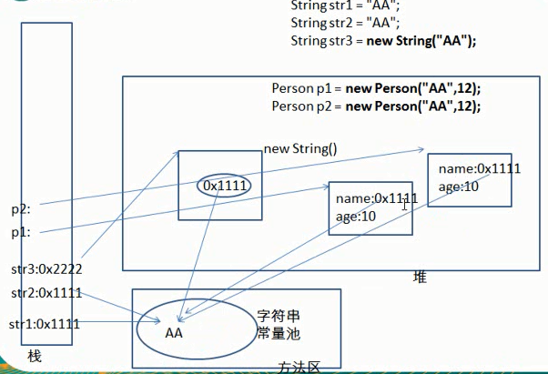
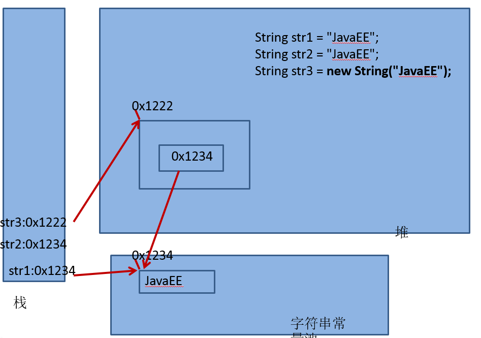
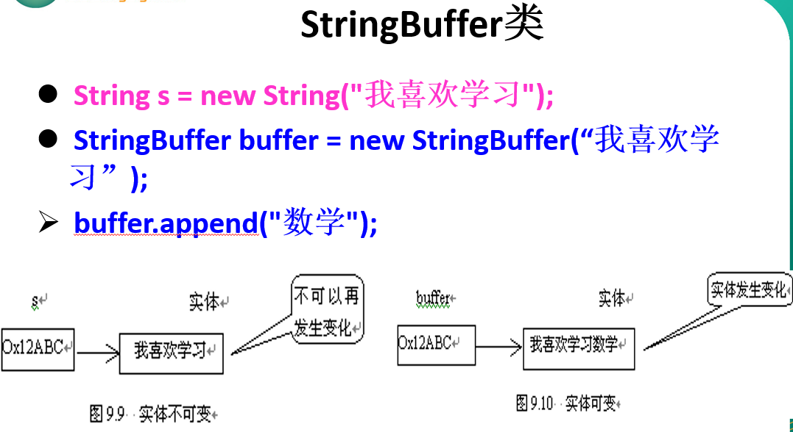

## String内存解析


## toString方法，默认是返回类名和hascode
* 打印一个引用对象时，实际上默认就是调用这个对象的`toString()`方法
* 当打印对象所在的类没有重写Object中的`toString()`方法时，那么调用的就是Object中定义的`toString()`，返回此对象所在的类及对应的堆空间对象实体的首地址值
* 当打印的对象所在的类重写了`toString()`方法时，调用的就是我们自己重写的`toString()`方法
* 将对象的属性细信息返回
* 像`String`类、`包装类`、`File`类、`Date`类等已经重写了Object的`toString()`
```
public String toString() {
    return getClass().getName() + "@" + Integer.toHexString(hashCode());
}
```

## String构造字符串对象
1. 字符串的字符使用Unicode字符编码，一个字符占两个字节
2. String类较常用构造方法
    - String  s1 = new String();
    - String  s2 = new String(String original);
    - String  s3 = new String(char[] a);
    - String  s4 =  new String(char[] a,int startIndex,int count)
3. String:代表不可变的字符，底层使用`char[]`存放
4. String str  = “abc”;与String str1 = new String(“abc”);的区别
    - 前置只涉及一个对象，栈中值指向字符串常量池
    - 后者涉及2个对象，栈中的值指向堆中值，堆中的值再指向字符串常量池
    - 本质最后都指向字符串常量池中的字符


## StringBuffer
1. `java.lang.StringBuffer`代表可变的字符序列，可以对字符串内容进行增删
2. 很多方法与String相同，但StingBuffer是可变长度的

## StringBuffer构造方法
1. StringBuffer()初始容量为16的字符串缓冲区
2. StringBuffer(int size)构造指定容量的字符串缓冲区
3. StringBuffer(String str)将内容初始化为指定字符串内容 
  

## StringBuilder
1. StringBuilder 和 StringBuffer 非常类似，均代表可变的字符序列，而且方法也一样
    - String：不可变字符序列
    - StringBuffer：可变字符序列、效率低、线程安全
    - StringBuilder(JDK1.5)：可变字符序列、效率高、线程不安全
2. String使用陷阱
> string s="a"; //创建了一个字符串<br>
> s=s+"b"; //实际上原来的"a"字符串对象已经丢弃了，现在又产生了一个字符串s+"b"（也就是"ab")。如果多次执行这些改变串内容的操作，会导致大量副本字符串对象存留在内存中，降低效率。如果这样的操作放到循环中，会极大影响程序的性能