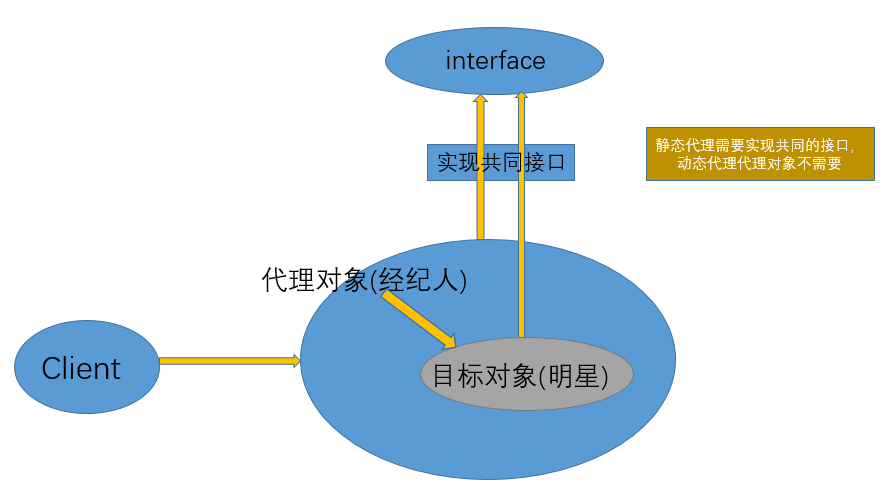

## 代理设计模式
> 代理(Proxy)是一种设计模式,提供了对目标对象另外的访问方式;即通过代理对象访问目标对象.这样做的好处是:`可以在目标对象实现的基础上,增强额外的功能操作,即扩展目标对象的功能`<br>
> 编程思想:`不要随意去修改别人已经写好的代码或者方法,如果需改修改,可以通过代理的方式来扩展该方法`<br>
> 举例：假设我们想邀请一位明星,那么并不是直接连接明星,而是联系明星的经纪人,来达到同样的目的.明星就是一个目标对象,他只要负责活动中的节目,而其他琐碎的事情就交给他的代理人(经纪人)来解决.这就是代理思想在现实中的一个例子<br>


* 注意：代理对象是对目标对象的扩展，并会调用目标对象

## 静态代理
* 静态代理在使用时,需要定义接口或者父类,被代理对象与代理对象一起实现相同的接口或者是继承相同父类
```
/**
 * 接口
 */
public interface IUserDao {

    void save();
}

/**
 * 接口实现
 * 目标对象
 */
public class UserDao implements IUserDao {
    public void save() {
        System.out.println("----已经保存数据!----");
    }
}

/**
 * 代理对象,静态代理
 */
public class UserDaoProxy implements IUserDao{
    //接收保存目标对象
    private IUserDao target;
    public UserDaoProxy(IUserDao target){
        this.target=target;
    }

    public void save() {
        System.out.println("开始事务...");
        target.save();//执行目标对象的方法
        System.out.println("提交事务...");
    }
}

/**
 * 测试类
 */
public class App {
    public static void main(String[] args) {
        //目标对象
        UserDao target = new UserDao();

        //代理对象,把目标对象传给代理对象,建立代理关系
        UserDaoProxy proxy = new UserDaoProxy(target);

        proxy.save();//执行的是代理的方法
    }
}
```
>静态代理总结：
>* 可以做到在不修改目标对象的功能前提下,对目标功能扩展.
>* 因为代理对象需要与目标对象实现一样的接口,所以会有很多代理类,类太多.同时,一旦接口增加方法,目标对象与代理对象都要维护

## 动态代理优点
1. `代理对象,不需要实现接口`。**被代理对象还需要实现接口**
2. 代理对象的生成,是利用JDK的API,动态的在内存中构建代理对象(需要我们指定创建代理对象/目标对象实现的接口的类型)
3. 动态代理也叫做:JDK代理,接口代理(JDK包)
    * `java.lang.reflect.Proxy` 用于生成代理对象
    * JDK实现代理只需要使用newProxyInstance方法,但是该方法需要接收三个参数,完整的写法是 `static Object newProxyInstance(ClassLoader loader, Class<?>[] interfaces,InvocationHandler h )`
        - `ClassLoader loader` 指定当前目标对象使用类加载器,获取加载器的方法是固定的
        - `Class<?>[] interfaces` 目标对象实现的接口的类型,使用泛型方式确认类型
        - `InvocationHandler h` 事件处理,执行目标对象的方法时,会触发事件处理器的方法,会把当前执行目标对象的方法作为参数传入
```
/**
 * 创建动态代理对象
 * 动态代理不需要实现接口,但是需要指定接口类型
 */
public class ProxyFactory{

    //维护一个目标对象
    private Object target;
    public ProxyFactory(Object target){
        this.target=target;
    }

   //给目标对象生成代理对象
    public Object getProxyInstance(){
        return Proxy.newProxyInstance(
                target.getClass().getClassLoader(),
                target.getClass().getInterfaces(),
                new InvocationHandler() {
                    @Override
                    public Object invoke(Object proxy, Method method, Object[] args) throws Throwable {
                        System.out.println("开始事务2");
                        //执行目标对象方法
                        Object returnValue = method.invoke(target, args);
                        System.out.println("提交事务2");
                        return returnValue;
                    }
                }
        );
    }

}

/**
 * 测试类
 */
public class App {
    public static void main(String[] args) {
        // 目标对象
        IUserDao target = new UserDao();
        // 【原始的类型 class cn.itcast.b_dynamic.UserDao】
        System.out.println(target.getClass());

        // 给目标对象，创建代理对象
        IUserDao proxy = (IUserDao) new ProxyFactory(target).getProxyInstance();
        // class $Proxy0   内存中动态生成的代理对象
        System.out.println(proxy.getClass());

        // 执行方法   【代理对象】
        proxy.save();
    }
}
```
>`代理对象不需要实现接口,但是目标对象一定要实现接口,否则不能用动态代理`

## Cglib代理
* 静态代理和动态代理模式都是`要求目标对象是实现一个接口的目标对象`,但是有时候目标对象只是一个单独的对象,`并没有实现任何的接口`,这个时候就可以使用以目标对象子类的方式类实现代理,这种方法就叫做:Cglib代理
* Cglib代理,也叫作子类代理,它是在内存中构建一个子类对象从而实现对目标对象功能的扩展
```
/**
 * 目标对象,没有实现任何接口
 */
public class UserDao {

    public void save() {
        System.out.println("----已经保存数据!----");
    }
}

/**
 * Cglib子类代理工厂
 * 对UserDao在内存中动态构建一个子类对象
 */
public class ProxyFactory implements MethodInterceptor{
    //维护目标对象
    private Object target;

    public ProxyFactory(Object target) {
        this.target = target;
    }

    //给目标对象创建一个代理对象
    public Object getProxyInstance(){
        //1.工具类
        Enhancer en = new Enhancer();
        //2.设置父类
        en.setSuperclass(target.getClass());
        //3.设置回调函数
        en.setCallback(this);
        //4.创建子类(代理对象)
        return en.create();

    }

    @Override
    public Object intercept(Object obj, Method method, Object[] args, MethodProxy proxy) throws Throwable {
        System.out.println("开始事务...");

        //执行目标对象的方法
        Object returnValue = method.invoke(target, args);

        System.out.println("提交事务...");

        return returnValue;
    }
}

/**
 * 测试类
 */
public class App {

    @Test
    public void test(){
        //目标对象
        UserDao target = new UserDao();

        //代理对象
        UserDao proxy = (UserDao)new ProxyFactory(target).getProxyInstance();

        //执行代理对象的方法
        proxy.save();
    }
}
```
>在Spring的AOP编程中:<br>
>如果加入容器的目标对象有实现接口,用JDK代理<br>
>如果目标对象没有实现接口,用Cglib代理<br>

>内容来自： https://www.cnblogs.com/cenyu/p/6289209.html