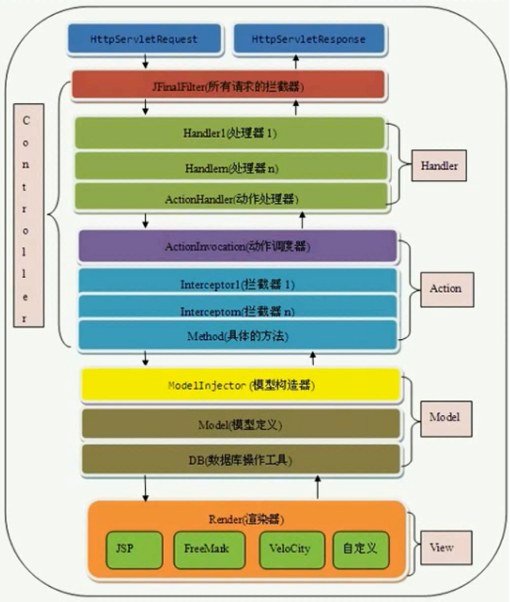

## Jfinal架构图

> ActionInvocation新版本中已经改为Invocation

## Jfinal处理流程
1. `http`处理客户端请求与响应
2. `Filter` 接收服务器发送过来的`request`，并进行处理
3. `Handler` 接收Filter发起的`handle`请求，处理资源文件。是一个责任链模式的变种，由初始化配置的`Handler[configHandler(Handlers me)]`及框架默认的`ActionHandler`构成一个链条，依次执行
4. `Action` 动作处理器，具体业务的执行，修饰符必须是`public`。由`ActionInvocation`进行调度，先执行`拦截器`，最后执行具体方法
5. `模型层` 包括尸体模型的定义、 DB + ActiveRecord模式数据库操作的支持、从请求中解析出对应参数构造器Model实例。可认为是`DAO`
6. `Render` 渲染器负责将服务器端的数据组装成客户端需要的数据格式，然后`response`到客户端

## Jfianl包结构
1. `com.jfinal.aop` 拦截器相关
2. `com.jfinal.captcha` 验证码相关
3. `com.jfinal.config` 项目配置相关
    * `Constants` 保存项目相关的常量
    * `Handlers` 保存资源处理器
    * `Interceptors` 保存拦截器
    * `Plugins` 保存插件
    * `Routes` 保存Action映射
    * `JFinalConfig` 抽象类。在此处设置项目要保存各种信息
4. `com.jfinal.core` jfinal项目的核心文件
    * `Const` JFinal默认设置，来实现COC原则
    * `Config` JFinal项目的配置信息，Constants、Handlers、Interceptors Plugins、Routes 都在此处保存
    * `Controller` Jfinal的控制器，里面封装了`HttpServletRequest`和`HttpServletResponse`及相关方法，还可以获取`controllerKey`
    * `ControllerFactory` Controller的工厂类
    * `Action` Controller中定义的`public`方法称为Action。Action是最小的请求单位。
    * `ActionKey` 类似`RequestMapping`强制覆盖路由规则
    * `NoAction` 声明改public method不是Action
    * `ActionMapping` 映射所有访问路径和其对应的Action，填充得到一个 HashMap
    * `ActionHandler`
5. `com.jfinal.ext`
6. `com.jfinal.handler` Jfinal的Handler资源处理器
7. `com.jfinal.i18n` Jfinal国际化处理
8. `com.jfinal.json` json文件处理
    * `FastJson`
    * `Jackson`
9.  `com.jfinal.kit` 工具类
10. `com.jfinal.log` log类
11. `com.jfinal.plugin` jfinal自己实现的插件
    *   
12. `com.jfinal.render` 视图渲染器，渲染JSP，Freemarker。。。
13. `com.jfinal.server` server接口
14. `com.jfinal.template`
15. `com.jfinal.token`
16. `com.jfinal.upload` 文件上传
17. `com.jfinal.validate` 验证，实现了`Interceptor`
18. `pom.xml` 声明了Jfinal项目的依赖