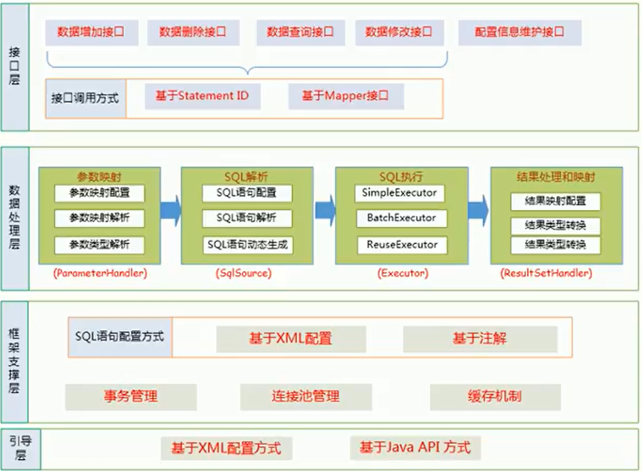
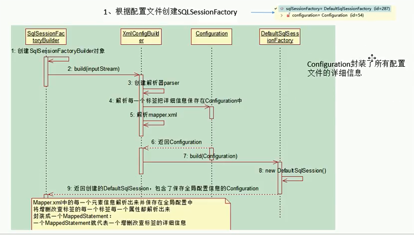
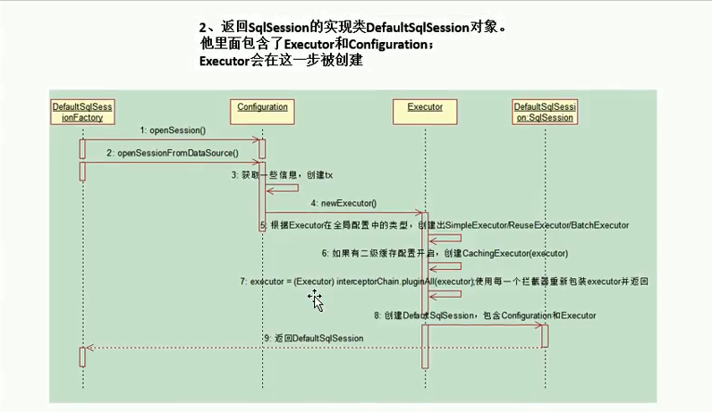
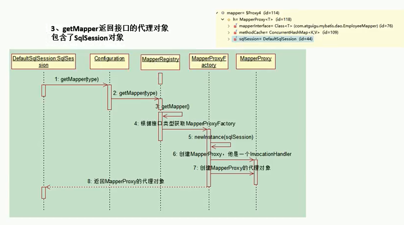

## MyBatis运行原理
1. 获取sqlSessionFactory对象
    * 解析文件的每一个信息保存在`Configuration`中，返回包含Configuration的`DefaultSqlSession`对象
    * 注意：「MappedStatement」代表一个增删改查的详细信息
2. 获取sqlSession对象
    * 返回DefaultSqlSession对象，包含`Executor`和`Configuration`，这一步会创建`Executor`对象
3. 获取接口的代理对象（MapperProxy）
    * `getMapper`，使用`MapperProxyFactory`创建一个MapperProxy的代理对象
    * 代理对象里面包含了 `DefaultSqlSession（Executor）`
4. 执行增删改查方法

## MyBatis框架图

## 运行图

