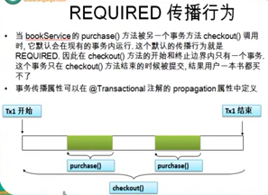
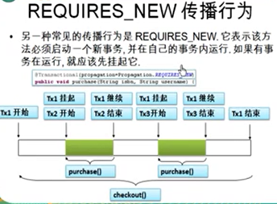

## spring事务实现
事务保证事件的完整性，比如转账，从一个人的账户里转出，转到另外一个人的账户里

## spring代码的实现
1. beans.xml文件里需要先引入`tx`命名空间`xmlns:tx="http://www.springframework.org/schema/tx"`
2. beansx.xml添加2个bean的实例
```
<!-- 配置事务管理 -->
<bean id="transactionManager" 
    class="org.springframework.jdbc.datasource.DataSourceTransactionManager">
    <property name="dataSource" ref="dataSource" />
</bean>

<!-- 启用事务bean 如果不用@Transactional这个注解实现事务就不需要tx:annotation-driven
如果用aop实现事务需要在aop:config中声明事务通知（tx:advice） -->
<tx:annotation-driven transaction-manager="transactionManager"> </tx:annotation-driven>
```
3. 在相应java代码出添加`@Transactional`
```
@Transactional
public void purchase(String username, String isbn)
```
## 事务的传播属性
当事务方法被另外一个事务方法调用时，必须指定事务应该如何传播。例如：方法可能继续在现有事务中运行，也可能开启一个新事务，并在自己事务中运行
1. `REQUIRED` 默认属性。如果存在一个事务，则支持当前事务。如果没有事务则开启一个新的事务<br>

2. `MANDATORY` 支持当前事务，如果当前没有事务，就抛出异常。<br>
 
3. `NEVER` 以非事务方式执行，如果当前存在事务，则抛出异常。 
4. `NOT_SUPPORTED` 以非事务方式执行操作，如果当前存在事务，就把当前事务挂起。
5. `REQUIRES_NEW` 新建事务，如果当前存在事务，把当前事务挂起。
6. `SUPPORTS` 支持当前事务，如果当前没有事务，就以非事务方式执行。
7. `NESTED`  如果当前存在事务，则在嵌套事务内执行。如果当前没有事务，则进行与PROPAGATION_REQUIRED类似的操作
## 事务的隔离级别
* `isolation` 指定事务的隔离级别，最常用的是'READ_COMMITTED'读已提交
* `rollbackFor` 默认情况下Spring的声明式事务对所有的运行时异常进行回滚，也可以通过对应属性镜像设置
* `noRollbackFor={UserAccountException.class}` 对那些异常不回滚
* `readOnly` 指定事务是否为只读，只读取事务不更新数据
* `timeout=1` 默认为秒，指定强制回滚之前事务可以占用的时间
## 事务的XML文件配置方式
```
<!-- 1. 配置bean -->
<bean id="bookShopDao" class="">
    <property name="jdbcTemplate" ref="jdbcTemplate"></property>
</bean>
<bean id="bookShopService" class="">
    <property name="bookShopService" ref="bookShopDao"></property>
</bean>
<bean id="cashier" class="">
    <property name="bookShopService" ref="bookShopService"></property>
</bean>

<!-- 2. 配置事务管理器 -->
<bean id="transactionManager" 
       class="org.springframework.jdbc.datasource.DataSourceTransactionManager">
    <property name="dataSource" ref="dataSource" />
</bean>
 
 <!-- 3. 配置事务属性 -->
<tx:advice id="txAdvice" transaction-manager="transactionManager">
    <tx:attributes>
        <!-- 根据方法名指定事务的属性 -->
        <tx:method name="purchase" propagation=REQUIRES_NEW"" />
        <tx:method name="get" read-only="true" />
        <tx:method name="find" read-only="true" />
        <tx:method name="*" />
    </tx:attributes>
</tx:advice>

<!-- 4. 配置事务切入点，以及把事务切入点和事务属性关联起来 -->
<aop:config>
    <aop:pointcut expression="execution(* com.*)" id="txPointCut">
    <aop:advisor advice-ref="txAdvice" pointcut-ref="txPointCut">
</aop:config>
```
