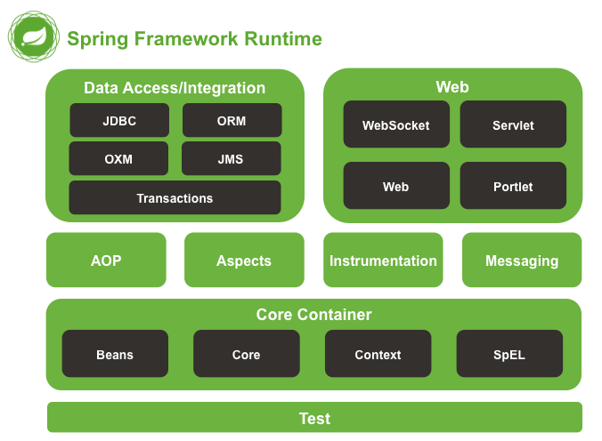
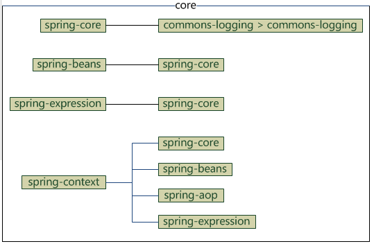
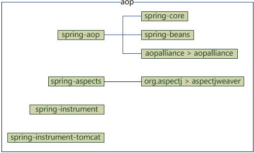
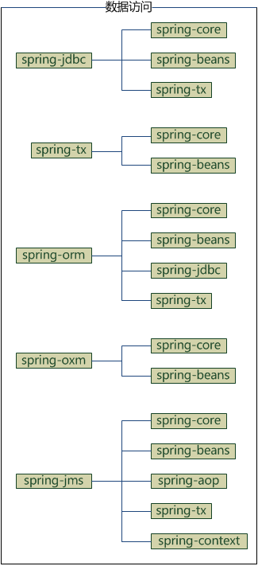
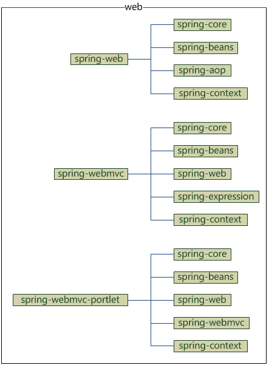
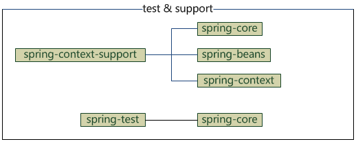

## srping体系结构
* 普通Java工程使用spring框架，只需要一个
```
<dependency>
    <groupId>org.springframework</groupId>
    <artifactId>spring-context</artifactId>
    <version>3.2.17.RELEASE</version>
</dependency>
```
* web工程中使用spring mvc，也只需要一个依赖
```
<dependency>
    <groupId>org.springframework</groupId>
    <artifactId>spring-webmvc</artifactId>
    <version>3.2.17.RELEASE</version>
</dependency>
```
## spring 架构图

>1. 图中将spring分为5个部分:test, core, aop, data access, web图中每个圆角矩形都代表一个jar，如果在maven中配置，所有这些jar的**groudID**都是**org.springframework**，每个jar有一个不同**artifactId**。
> 2. 另外，"Instrumentation"有2个jar，还有一个**spring-context-support**图中，没有列出，所有spring 4中一共有20个jar包

### core 包含4个模块
* spring-core: 依赖注入的DI的最基本实现
* spring-beans: Bean工厂与bean的装配
* spring-context: spring的context上下文(即Ioc容器)
* spring-expression language: spring表达式语言(SpEL)<br>

> 因为spring-core依赖了commons-logging，而其它模块都依赖了spring-core，所以整个spring框架都依赖了commons-logging，如果有自己的日志实现如log4j，可以排除对commons-logging，没有日志实现而排除了commons-logging依赖，编译报错
```
<dependency>
    <groupId>org.springframework</groupId>
    <artifactId>spring-context</artifactId>
    <version>3.2.17.RELEASE</version>
    <exclusions>
        <exclusion>
            <groupId>commons-logging</groupId>
            <artifactId>commons-logging</artifactId>
        </exclusion>
    </exclusions>
</dependency>

<!-- 配置核心依赖-->
<properties>
    <org.springframework.version>4.0.2.RELEASE</org.springframework.version>    
</properties>
<dependency>
    <groupId>org.springframework</groupId>
    <artifactId>spring-core</artifactId>
    <version>${org.springframework.version}</version>
    <scope>runtime</scope>
</dependency>
<dependency>
    <groupId>org.springframework</groupId>
    <artifactId>spring-context</artifactId>
    <version>${org.springframework.version}</version>
    <scope>runtime</scope>
</dependency>
<dependency>
    <groupId>org.springframework</groupId>
    <artifactId>spring-beans</artifactId>
    <version>${org.springframework.version}</version>
    <scope>runtime</scope>
</dependency>
<dependency>
    <groupId>org.springframework</groupId>
    <artifactId>spring-expression</artifactId>
    <version>${org.springframework.version}</version>
    <scope>runtime</scope>
</dependency>
```

## aop 包含4个模块
* spring-aop: 面向切片编程
* spring-aspects: 集成AspectJ
* spring-instrument: 提供一些类级的工具支持和ClassLoader级的实现，用于服务器 
* spring-instrument-tomcat: 针对tomcat的instrument实现
* maven中引入相关的依赖
```
<!-- AOP的核心包已经包含在spring-context和Spring-tx -->
<!-- aspecj的runtime包 -->
<dependency>
    <groupId>org.aspectj</groupId>
    <artifactId>aspectjrt</artifactId>
    <version>1.6.11</version>
</dependency>
<!-- aspecj的织入包 -->
<dependency>
    <groupId>org.aspectj</groupId>
    <artifactId>aspectjweaver</artifactId>
    <version>1.6.11</version>
</dependency>
<!-- 用来动态代理用的,基于类的代理 -->
<dependency>
    <groupId>cglib</groupId>
    <artifactId>cglib</artifactId>
    <version>2.1</version>
</dependency>
```
<br>



## data access 包含5个模块
* spring-jdbc: jdbc的支持
* spring-tx: 事务控制
* spring-orm: 对象关系映射，集成orm框架
* spring-oxm: 对象xml映射
* spring-jms: java消息服务
<br>

```
<dependency>
    <groupId>org.springframework</groupId>
    <artifactId>spring-orm</artifactId>
    <version>${org.springframework.version}</version>
</dependency>
```

## web 包含4个模块
* spring-web: 基础web功能，如文件上传
* spring-mvc: mvc实现
* spring-webmvc-portlet: 基于portle的mvc实现
* spring-websocket: 为websock-based提供了支持，而且在web应用程序中提供了客户端和服务器端之间通信的两种方式<br>


```
<dependency>
    <groupId>org.springframework</groupId>
    <artifactId>spring-web</artifactId>
    <version>${org.springframework.version}</version>
</dependency>
<dependency>
    <groupId>org.springframework</groupId>
    <artifactId>spring-webmvc</artifactId>
    <version>${org.springframework.version}</version>
</dependency>
```

## test 包含1个包
* spring-test: spring测试，提供junit和mock测试功能
* spring-context-spport: spring额外包支持，比如邮件服务，试图解析(放在一块说)<br>


## websock&messaging


## 如果Maven Repository不能同步的，可使用阿里云仓库
```
<!-- 使用阿里 maven 库 -->
<repositories>
    <repository>
        <id>ali-maven</id>
        <url>http://maven.aliyun.com/nexus/content/groups/public</url>
        <releases>
            <enabled>true</enabled>
        </releases>
        <snapshots>
            <enabled>true</enabled>
            <updatePolicy>always</updatePolicy>
            <checksumPolicy>fail</checksumPolicy>
        </snapshots>
    </repository>
</repositories>
```