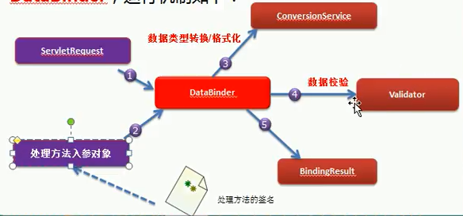

## 数据绑定流程
1. SpringMVC主框架将`ServletRequest`对象及目标方法的入参实例传递给`WebDataBinderFacotry`实例，以创建`DataBinder`实例对象
2. `DataBinder`调用装配在SpringMVC上下文中的`ConversionService`组件进行`数据类型转换、数据格式化`工作。将Servlet中的请求信息填充到入参对象中
3. 调用`Validator`组件对已绑定了请求消息的入参对象进行数据合法性校验，并最终生成数据绑定结果`BindingData`对象
4. SpringMVC抽取`BindingResult`中的入参对象和校验错误对象，将它们赋给处理方法
5. SpringMVC通过反射机制对目标处理方法进行解析，将请求消息绑定到处理方法的入参中。数据绑定的核心部件时`DabaBinder`<br>


## 数据转换
1. SpringMVC上下文中内建了很多转换器，可以完成大多数Java类型的转换工作
2. 自定义类型转换器
    1. `ConversionService` 是Spring类型转换体系的核心接口
    2. 可以利用`ConversioonServiceFacotryBean`在Spring的IOC容器中定义一个`ConversersionService`,Spring将自动识别出IOC容器中的`ConversionService`，并在Bean属性配置及SpringMVC处理方法入参绑定等场合使用它进行数据的转换
    3. 可通过`ConversionServiceFactoryBean`的`converters`属性注册自定义的类型转换器
```
<bean id ="conversionService" calss="org.springframework.context.support.ConversionServiceFactoryBean">
    <property name="converters">
        <list>
            <bean class="com.atguigu.springmvc.UserConverter">
        </list>
</bean>
```
3. `<mvc:annotation-driven conversion-service="conversionService">` 会将自定义的`ConversionService`注册到SpringMVC的上下文中

## mvc:annotation-driven
1. 会自动注册
    1. `RequestMappingHandlerMapping`
    2. `RequestMappingHandlerAdapter` 
    3. `ExceptionHandlerExceptionResolver`
2. 提供以下支持
    1. 支持使用`ConversionService`实例对表单参数进行类型转换
    2. 支持使用`@NumberFormatannotation`、`@DateTimeFormat`注解完成数据类型的格式化
    3. 支持使用`@Valid`注解对JavaBean实例进行JSR303验证
    4. 支持使用`@RequestBody`和`@Responsebody`注解

## @InitBinder
1. 由`@InitBinder`标识的方法，可以对`WebDataBinder`对象进行初始化。WebDatabinder是DataBinder的子类，用于完成由表单字段到JavaBean属性的绑定
2. `@InitBinder`方法不能有返回值，它必须声明为void
3. `@InitBinder`方法的参数通常是`WebDataBinder`
```
/**
 * 不自动绑定对象中的roleSet属性，另行处理
 */
 @InitBinder
 public void initBinder(WebDataBinder dataBinder) {
     dataBinder.setDisallowedFields("roleSet");
 }
```

## @DateTimeFormat(pattern="yy-MM-dd") 格式化时间
## @NumberFormat(pattern="#,###,###.#") 格式化数字
## BindingResult 查看数据返回结果

## 数据验证
1. 使用JSR 303验证标准
2. 加入hibernate validator验证框架
```
<dependency>
    <groupId>org.hibernate</groupId>
    <artifactId>hibernate-validator</artifactId>
    <version>${hibernate-validator.version}</version>
</dependency>
<dependency>
    <groupId>javax.el</groupId>
    <artifactId>javax.el-api</artifactId>
    <version>2.2.4</version>
</dependency>
<dependency>
    <groupId>org.glassfish.web</groupId>
    <artifactId>javax.el</artifactId>
    <version>2.2.4</version>
</dependency>
```
3. 在SpringMVC配置文件中添加`<mvc:annotation-driven>`
4. 需要在bean的属性上添加对应的注解
    1. `@Null`
    2. `@NotNull`
    3. `@Past`
    4. `@Future`
    5. `@Pattern(value)`
    6. `@Min(value)`
    7. `@Max(value)`
    8. `@Email`
5. 在目标方法bean类型的前面添加`@Valid`注解，在入参处
6. 需要校验的Bean对象和其绑定结果对象或错误对象成对出现时，它们之间不允许声明其他的入参
7. 显示所有错误`<form-errors path="*"></form:errors>` 
8. 显示单个错误`<form-errors path="lastName"></form:errors>`