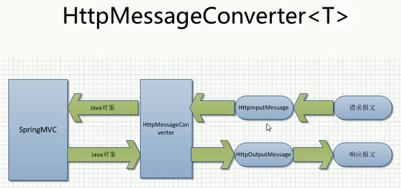

## 处理JSON
1. 加入`jackson`相关jar包
2. 编写目标方法，使其返回JSON对应的对象或集合
3. 在目标方法上添加`@ResponseBody`注解

## HttpMessageConverter<T>
1. `HttpMessageConverter<T>` 是Spring3.0新添加的一个接口，负责将请求信息转换为一个对象(类型为T)，将对象(类型为T)输出为响应信息<br>

2. 使用`HttpMessageConverter<T>`将请求信息转化并帮绑定到处理方法的入参中或将响应结果转为对应类型的信息，Spring提供给了两种途径
    1. 使用`@RequestBody / @ResponseBody`对处理方法进行标注
    2. 使用`HttpEntity<T> / ResponseEntity<T>`作为处理方法的入参或返回值
3. 当控制器处理方法使用到`@Requestbody / @ResponseBody`或`HttpEntity<T> / ResponseEntity<T>`时，Spring首先根据请求头或响应头的Accept属性选择匹配的`HttpMessageConverter`，进而根据参数类型或泛型类型的过滤器得到匹配的`HttpMessageConverter`，若找不到可用的`HttpMessageConverter`将报错
4. `@RequestBody / @ResponseBody` 不需要成对出现

#### Java代码展示
```
    @ResponseBody
    @RequestMapping("/testHttpMessageConverter")
    public String testHttpMessageConverter(@RequestBody String body) {
        System.out.println(body);
        // 没有对应的页面处理，加@ResponseBody来直接转换为字符串
        return "hello world :" + new Date();
    }
```

#### html代码展示
```
    <form action="testHttpMessageConverter" method="post" enctype="multipart/form-data">
        File: <input type="file" name="file">
        Desc: <input type="text" name="desc">
        <input type="submit" value="Submit">
    </form>
```

## 文件上传
1. 通过即插即用 `MultipartResolver`实现的，Spring用Jakarta Commons FileUpload技术实现了一个MultipartResolver的实现类`CommonsMultipartResolver` 
2. 默认没有装配`MultipartResolver`因此默认情况下不能处理文件的上传工作，需要在上下文中配置
3. `defaultEncoding` 必须和用户JSP的`pageEncoding`属性一致，以便正确解析表单的内容
4. `CommonsMultipartResolver` 正确工作，需添加`Jakarta Commons FileUpload`和`Jakarta Commons io`的类
5. 配置配置文件
```
     <bean id="multipartResolver" class="org.springframework.web.multipart.commons.CommonsMultipartResolver">
        <property name="defaultEncoding" value="UTF-8"></property>
        <property name="maxUploadSize" value="5242880"></property>
     </bean>
```

#### Java代码展示
```
    @RequestMapping("/testFileUpload")
    public String testFileUpload(@ReqeustParam("desc") String desc, @ReqeustParam("file") MultipartFile file) {
        System.out.println("desc");
        return SUCCESS;
    }
```

#### html代码展示
```
    <form action="testFileUpload" method="post" enctype="multipart/form-data">
        File: <input type="file" name="file">
        Desc: <input type="text" name="desc">
        <input type="submit" value="Submit">
    </form>
```