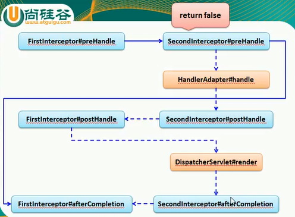

## 拦截器
SpringMVC可用使用拦截器对请求进行拦截处理，用户可用自定义拦截器来实现特定的功能，自定义拦截器必须实现`HandlerInterceptor`接口
1. `preHandle` 在业务处理器处理请求之前被调用，在该方法中对用户请求`request`进行处理。如果程序员决定该拦截器对请求进行拦截处理后还需要调用其它的拦截器，或者是业务处理器进行处理，则返回`true`；如果不需要其它组件去处理，则返回`false`
2. `postHandle()` 这个方法在业务处理器处理完请求后，但是`DispatcherSerlvet`向客户端返回`响应前`被调用，在该方法中对用户请求`request`进行处理
3. `afterCompletion()` 在`DispatcherServlet`完全处理完请求后被调用，可用在该方法中进行一些资源清理操作

#### Java代码展示
```
public class FirstInterceptor implements HandlerInterceptor {

    public boolean preHandle(HttpServletRequest request, HttpServletResponse response, Object handler)
            throws Exception {
        System.out.println("[FirstInterceptor]  preHandle");
        return true;
    }

    public void postHandle(HttpServletRequest request, HttpServletResponse response, Object handler,
            @Nullable ModelAndView modelAndView) throws Exception {

        System.out.println("[FirstInterceptor]  postHandle");
    }

    public void afterCompletion(HttpServletRequest request, HttpServletResponse response, Object handler,
            @Nullable Exception ex) throws Exception {

        System.out.println("[FirstInterceptor]  postHandle");
    }
}
```

#### html代码展示
```
    <mvc:interceptors>
        <!-- 配置自定义拦截器 -->
        <bean class="com.springmvctest.interceptor.FirstInterceptor"></bean>

        <!-- 配置拦截器（不）作用路径 -->
        <mvc:interceptor>
            <mvc:mapping path="/emps" />
            <bean class="com.springmvctest.interceptor.SecondInterceptor"></bean>
        </mvc:interceptor>
    </mvc:interceptors>
```

## 拦截器方法的执行顺序
1. `preHandle` 按照配置顺序 顺序执行
2. `postHandle` 按照配置顺序 逆序执行
3. `afterCompletion` 按照配置顺序 逆序执行<br>

