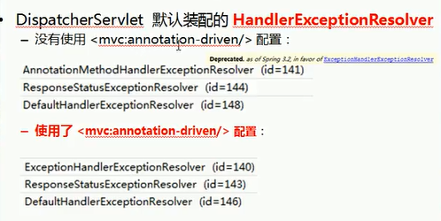

## 异常处理
SpringMVC通过`HanlderExceptionResolver`处理程序的异常，包括Handler映射，数据绑定以及目标方法执行时发生的异常<br>


## ExceptionHandlerExceptionResolver
1. 主要处理Hanlder中用`@ExceptionHandler`注解定义的方法
2. `@ExceptionHandler`注解定义的方法`优先级问题`：例如发生的是`NullPointerException`，但是声明的异常有`RuntimeException`和`Exception`，此时会根据异常的最近继承关系找到继承深度最浅的那个`@ExceptionHanlder`注解方法，即标记了`RuntimeException`的方法
3. `ExceptionHandlerMethodResolver`内部若找不到`@ExceptionHandler` 注解的化，会找`@ControllerAdvice`中的`@ExceptionHanlder`注解方法

#### java代码展示
```
/**
     * 1. 在@ExceptionHanlder 方法的入参中可以加入Exception类型的参数，该参数对应发生的异常对象
     * 2. @ExceptionHandler 方法的入参中不能传入Map，若希望吧异常信息显示在页面上，需要使用ModelAndView作为返回值
     * 3. @ExceptionHandler 方法标记的异常有优先级问题
     * 4. @ControllerAdvice 如果在当前Hanlder中找不到@ExceptionHandler方法来处理当前异常
     *    则将去@ControllerAdvice标记的类中查找@ExceptionHandler标记的方法处理
     */
    @ExceptionHandler({ArithmeticException.class})
    public ModelAndView handleAritheticExcetipint(Exception ex ) {
        System.out.println("出异常了" + ex);
        ModelAndView mv = new ModelAndView("error");
        mv.addObject("exception", ex);
        return mv;
    }

    @RequestMapping("/testExceptionHanlderExceptionResolver")
    public String testExceptionHanlderExceptionResolver(@RequestParam("i") int i) {
        System.out.println("result: " + (10 / i) );
        return SUCCESS;
    }
```

## ResponseStatusExceptionResolver
1. 在异常及异常父类中找到`@ResponseStatus`注解，然后使用这个注解的属性进行处理
2. 定义一个`@ResponseStatus`注解修饰的异常类
```
@ResponseStatus(HttpStatus.UNAUTHORIZED)
```
3. 若在处理方法中抛出了上述异常：若`ExceptionHandlerExceptionResolver`不解析上述异常。由于出发的异常`UnauthorizedException`带有`@ResponseStatus`注解。因此会被`ResponseStatusExceptionResolverr`解析到。最后响应`HttpStatus.UNAUTHORIZED`代表响应码401，无权限。
4. `@ResponseStatus`放在方法上面，方法会继续执行。放在类上面，原来方法不会执行

#### Java代码展示
```
// 定义异常类
@ResponseStatus(value=HttpStatus.UNAUTHORIZED, reason="用户名和密码不匹配")
public class UserNameNotMatchPasswordException extends RuntimeException {

    private static final long serialVersionUID = 1L;

}

// 映射方法
    @RequestMapping("/testResponseStatusExceptionResolver")
    public String testResponseStatusExceptionResolver(@RequestParam("i") int i) {
        
        if(i == 13) {
            throw new UserNameNotMatchPasswordException();
        }

        System.out.println("testResponseStatusExceptionResolver..");
        return SUCCESS;
    }
```

 ## DefaultHanlderExceptionResolver
 * 对一些特殊异常进行处理，比如：
    * NoSuchRequestHandlingMethodException
    * HttpRequestMethodNotSupportedException
    * HttpMediaTypeNotSupportedException
    * HttpMediaTypeNotAcceptabledException

## SimpleMappingExceptionResolver
如果希望对所有异常进行统一处理，可以使用`SimpleMappingExceptionResolver`,它将异常类名映射为视图，即发生异常时使用对应的视图报告异常

#### Java代码展示
```
    @RequestMapping("/testSimpleMappingExceptionResolver")
    public String testSimpleMappingExceptionResolver(@RequestParam("i") int i) {
        String[] vals = new String[10];
        System.out.println(vals[i]);
        return SUCCESS;
    }
```

#### 配置文件展示
```
    <!-- 配置使用SimpleMappingExceptionResolver 来映射 -->
    <bean class="org.springframework.web.servlet.handler.SimpleMappingExceptionResolver">
        <property name="exceptionMaping">
            <props>
                <!-- 要写全类名，会将异常放在requestScop里面 -->
                <prop key="java.lang.ArrayIndexOutOfBoundsException">error</prop>
            </props>
        </property>
    </bean>
```