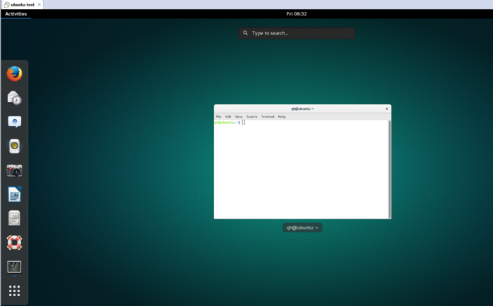

# Linux 发行版本的安装
### Linux 选择的[Ubuntu Gnome 16.04](http://http://ubuntugnome.org/download/)，比较喜欢关闭按钮在右上角

### 如果一直使用Unity GUI，可以使用下面方法替换
#### 1. 安装Gnome

```
sudo apt install gnome ubuntu-gnome-desktop gnome-shell
# 重要提示；安装过程中会让你选择gdm3 还是 lightdm，
# 如果你是在虚拟机里安装的请一定要选择lightdm！
# 如果是双系统用户请选择gdm3
# 因为gdm3与一部分nvida芯片不兼容，存在开不了机的情况
# 即使上面一不小心选错了，请在重启之前执行以下指令重新选择
  udo dpkg-reconfigure gdm
#  务必在重启之前配置
```
#### 2.删除unity 桌面环境（若是双系统用户，启动器选择是是gdm3，则不用删除，因为gdm3默认是gnome启动）
```
sudo apt purge unity
sudo apt purge unity-services
sudo apt purge unity-asset-pool
```
#### 3. 重启即可
```
sudo reboot
```


> 以上内容来自 简书， http://www.jianshu.com/p/206921fbca9c
