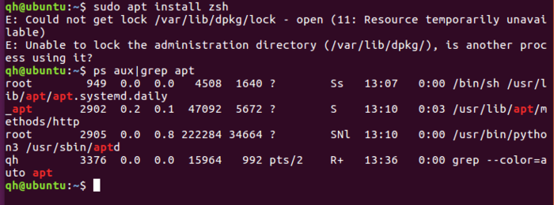
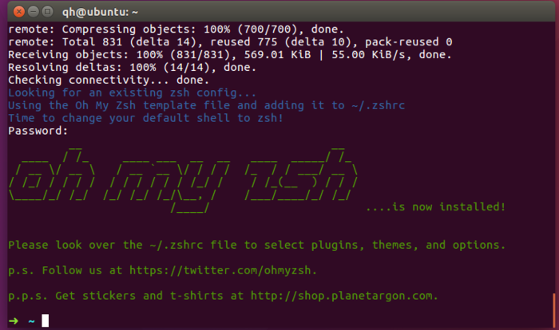
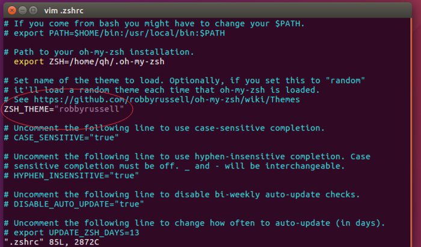
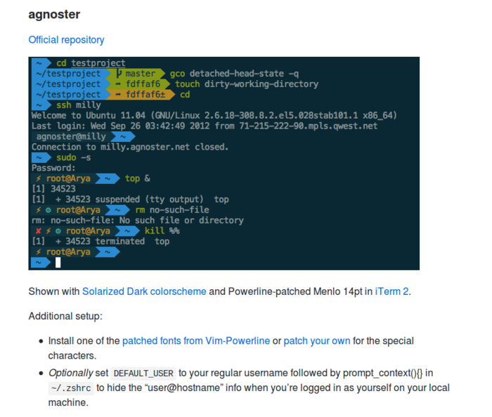
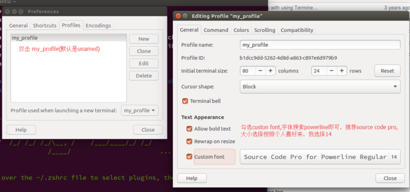
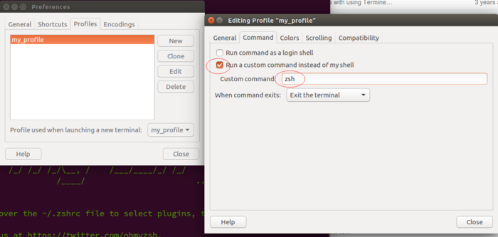
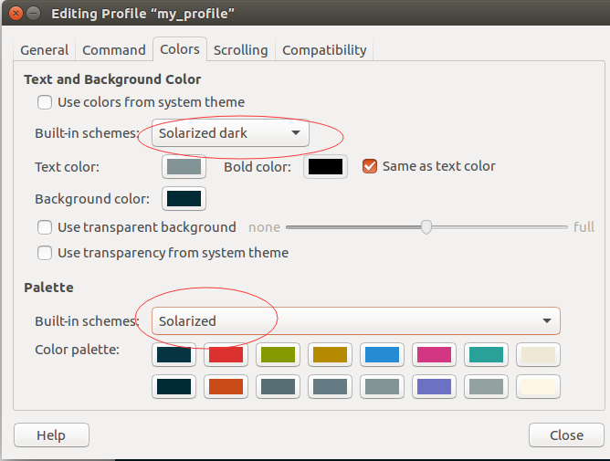

# oh-my-zsh的安装

##### 1. on-my-zsh是针对zsh的美化，zsh是一种特殊的shell， Mac默认使用，安装命令

`sudo apt install zsh`

* 如果提示apt正在使用，一般是daily正在更新，可以强制kill，也可等待更新完毕

`ps aux | grep apt`

##### 2. zsh安装完成之后，安装oh-my-zsh

`sh -c "$(wget https://raw.github.com/robbyrussell/oh-my-zsh/master/tools/install.sh -O -)"`

成功之后界面如下：

在用户根目录下的.zshrc内修改oh-my-zsh的主题

oh-my-zsh主题列表，可参考

https://github.com/robbyrussell/oh-my-zsh/wiki/themes

##### 3.安装powerline字体与配置shell

虽然oh-my-zsh已经安装成功，oh my zsh中比较讨喜的一款主题为agnoster，它需要额外安装powerline字体

###### 3.1安装powerline字体

Powerline的 github: https://github.com/powerline/fonts

安装步骤:

a) git clone https://github.com/powerline/fonts

b) cd fonts/

c) ./install.sh

###### 3.2配置shell

* 设置字体， 进入Terminal的首选项(Preferences)

* 设置默认以zsh方式启动shell

* 颜色配置，用solarized即可

###### 重启Terminal，就可以看到效果

>内容来自 简书， http://www.jianshu.com/p/206921fbca9c
