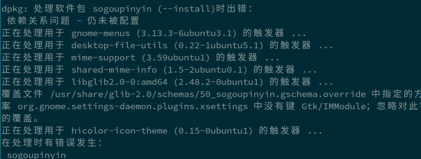
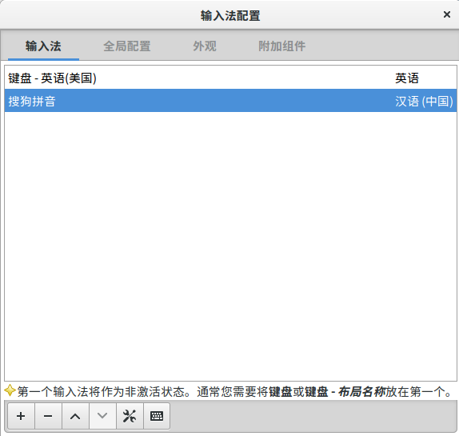
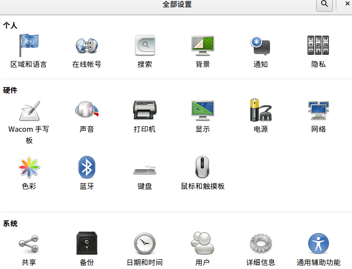
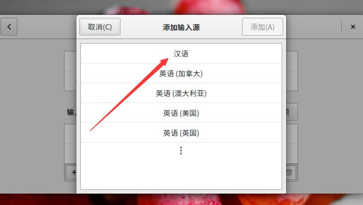
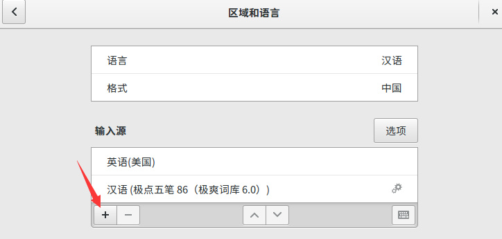
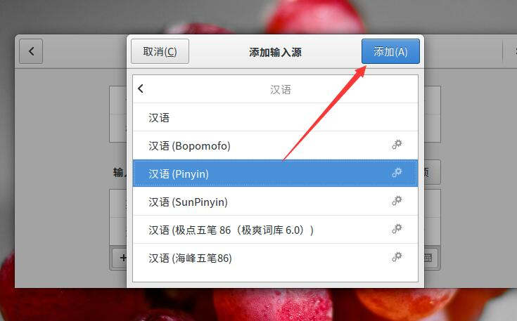

## 搜狗输入法的安装
##### 1. [官网下载安装包](https://pinyin.sogou.com/linux/?r=pinyin) ，我的是64位系统，因此选择的amd64
搜狗输入法是采用.deb形式发布，执行下面命令安装
`sudo dpkg -i sougou*.deb`
可能会出现下面错误：  

##### 2.错误解决，我之后又重新安装的
`sudo apt-get install -f`
##### 3.搜狗输入法配置
在**Fcitx配置**中，只保留搜狗输入法和英文，其余不用可直接删掉  

##### 4. Ctrl+Shift 愉快的切换输入法

## ibus输入法配置
直接参考截图，要选择区域和语言

> 搜狗输入法有参考文档： http://blog.topspeedsnail.com/archives/6955
> **ibus和搜狗输入法不能同时配置，否则 Ctrl+Shift不能切换出搜狗输入法**
