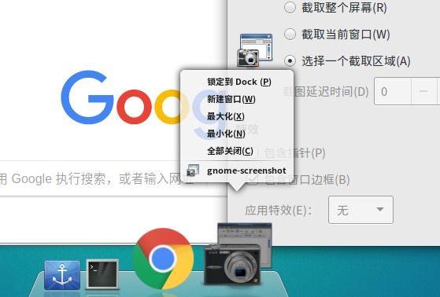
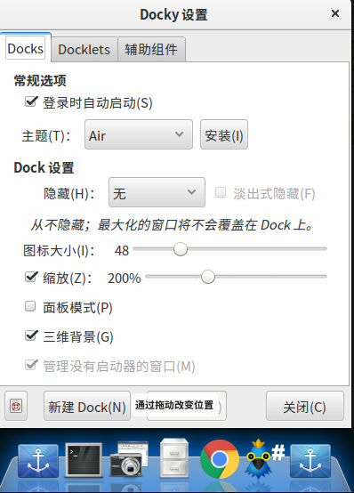

## Docky 安装
##### 1. Docky 是在屏幕中央显示应用程序，类似Mac中的Dock，安装命令
`sudo apt-get install docky`
##### 2. 将应用程序锁定到Docky上，打开应用程序，图标右键

##### 3. Docky设置，其中**智能隐藏**，是Docky和程序重叠时，自动隐藏

##### 4. Docklets
会显示提示的智能插件，比如垃圾箱，天气等
