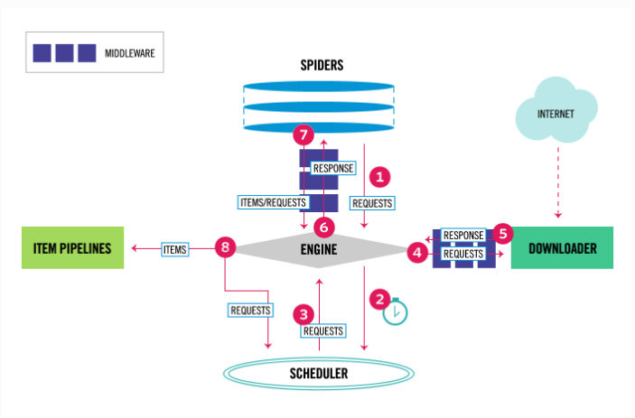

### Scrapy介绍
官方文档： https://docs.scrapy.org/en/latest/topics/architecture.html  
中文文档： http://scrapy-chs.readthedocs.io/zh_CN/latest/topics/architecture.html  

scrapy是为了爬取网站数据，提取结构性数据而编写的应用框架。

* Scrapy Engine  
引擎负责控制数据流在系统中所有组件中流动，并在相应动作发生时触发事件。 详细内容查看下面的数据流(Data Flow)部分。
* Spiders  
Spider是Scrapy用户编写用于分析response并提取item(即获取到的item)或额外跟进的URL的类。 每个spider负责处理一个特定(或一些)网站。最终返回Item
* 调度器(Scheduler)  
调度器从引擎接受request并将他们入队，以便之后引擎请求他们时提供给引擎。同时可以去除重复的url
* 下载器(Downloader)  
下载器负责获取页面数据并提供给引擎，而后提供给spider。最后返回一个response
* Item Pipeline  
Item Pipeline负责处理被spider提取出来的item。典型的处理有清理、 验证及持久化(例如存取到数据库中)。需要在settings里面打开才能使用
* 下载器中间件(Downloader middlewares)  
下载器中间件是在引擎及下载器之间的特定钩子(specific hook)，处理Downloader传递给引擎的response。 其提供了一个简便的机制，通过插入自定义代码来扩展Scrapy功能。
* Spider中间件(Spider middlewares)  
Spider中间件是在引擎及Spider之间的特定钩子(specific hook)，处理spider的输入(response)和输出(items及requests)。 其提供了一个简便的机制，通过插入自定义代码来扩展Scrapy功能。

#### 数据流(Data flow)
Scrapy中的数据流由执行引擎控制，其过程如下:

1. 引擎打开一个网站(open a domain)，找到处理该网站的Spider并向该spider请求第一个要爬取的URL(s)。
2. 引擎从Spider中获取到第一个要爬取的URL并在调度器(Scheduler)以Request调度。
3. 引擎向调度器请求下一个要爬取的URL。
4. 调度器返回下一个要爬取的URL给引擎，引擎将URL通过下载中间件(请求(request)方向)转发给下载器(Downloader)。
5. 一旦页面下载完毕，下载器生成一个该页面的Response，并将其通过下载中间件(返回(response)方向)发送给引擎。
6. 引擎从下载器中接收到Response并通过Spider中间件(输入方向)发送给Spider处理。
7. Spider处理Response并返回爬取到的Item及(跟进的)新的Request给引擎。
8. 引擎将(Spider返回的)爬取到的Item给Item Pipeline，将(Spider返回的)Request给调度器。
9. (从第二步)重复直到调度器中没有更多地request，引擎关闭该网站。
