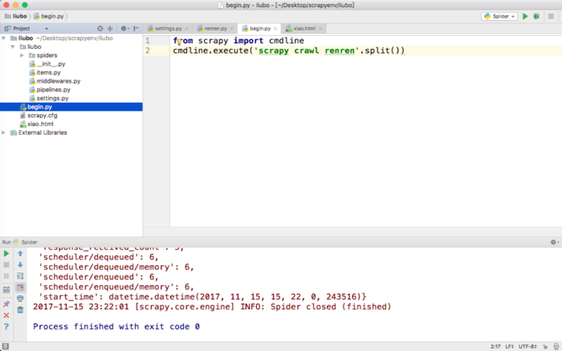
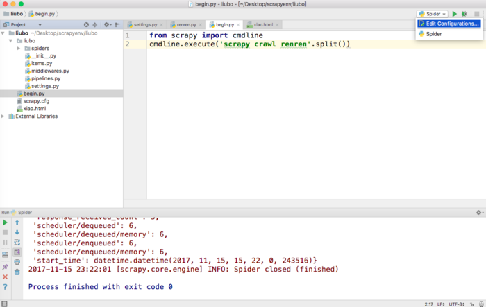
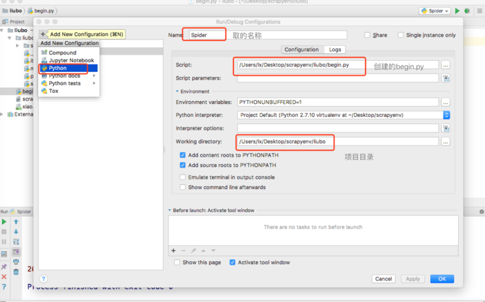

### pycharm配置scrapy直接能运行
##### Pycharm 添加Python Interpreter
如下图，点击右边齿轮，add local

##### Pycharm 直接运行Spider
* 打开项目，在和scrapy.cfg文件同级目录中创建一个名为begin.py文件，文件里面写上两行内容即可，启动scrapy的命令

* 点击右上角编辑配置选项

* 创建新的python配置文件，注意红框里面选择的对应文件即可，点击右下角ok即可使用

>内容来自简书：  https://www.jianshu.com/p/eda047ac5c89
